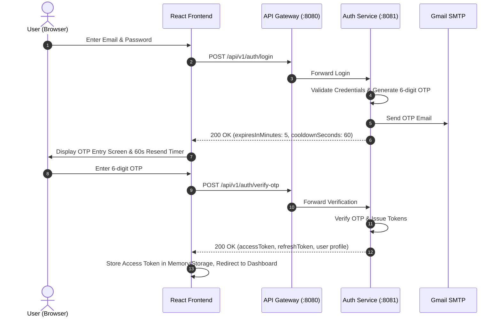
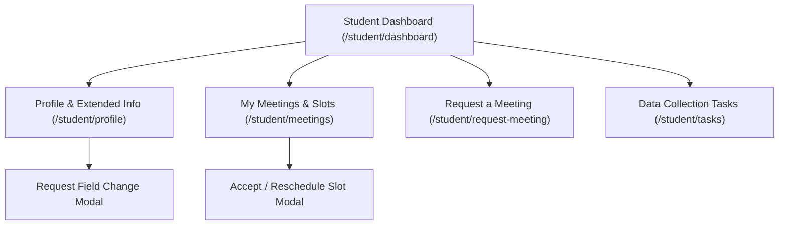
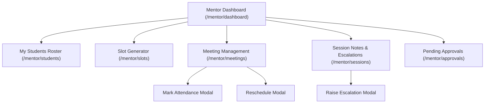
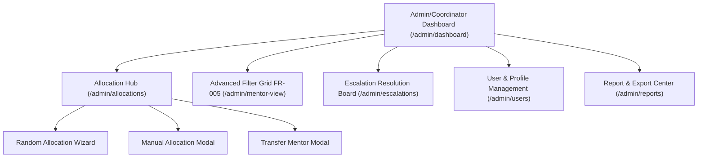

# Student Mentoring Management System (SMMS) — Frontend Development Specification & Backend API Contract

> **Target Audience:** Frontend Engineer / AI Frontend Agent  
> **Backend Architecture:** Spring Boot 3.3.x Microservices, Spring Cloud Gateway, Eureka Service Registry, MySQL 8 (Database-per-Service)  
> **Gateway Base URL:** `http://localhost:8080` (Local Dev) / Reverse Proxy (Production)  
> **Target Frontend Stack:** React (Vite / Next.js / React Router), TypeScript, Tailwind CSS / Shadcn UI / Material UI, Axios / TanStack Query (React Query)

---

## 📋 Table of Contents
1. [System Architecture & Communication Overview](#1-system-architecture--communication-overview)
2. [Global Authentication & Token Lifecycle](#2-global-authentication--token-lifecycle)
3. [User Roles, Permissions & Route Guards](#3-user-roles-permissions--route-guards)
4. [Standard Data Formats & Enums](#4-standard-data-formats--enums)
5. [Complete API Endpoint Catalog by Service](#5-complete-api-endpoint-catalog-by-service)
   - 5.1 [Auth Service (`/api/v1/auth`)](#51-auth-service-apiv1auth)
   - 5.2 [User Service (`/api/v1/users`)](#52-user-service-apiv1users)
   - 5.3 [Allocation Service (`/api/v1/allocations`)](#53-allocation-service-apiv1allocations)
   - 5.4 [Meeting Service (`/api/v1/meetings`)](#54-meeting-service-apiv1meetings)
   - 5.5 [Session & Escalation Service (`/api/v1/sessions`)](#55-session--escalation-service-apiv1sessions)
   - 5.6 [Dashboard & Report Service (`/api/v1/dashboard`, `/api/v1/reports`)](#56-dashboard--report-service-apiv1dashboard-apiv1reports)
6. [Frontend UI/UX Screens & Flow Architecture](#6-frontend-uiux-screens--flow-architecture)
   - 6.1 [Authentication Flows](#61-authentication-flows)
   - 6.2 [Student Portal Flows](#62-student-portal-flows)
   - 6.3 [Mentor Portal Flows](#63-mentor-portal-flows)
   - 6.4 [Coordinator / Admin Portal Flows](#64-coordinator--admin-portal-flows)
7. [API Client Setup & Error Handling Best Practices](#7-api-client-setup--error-handling-best-practices)

---

## 1. System Architecture & Communication Overview

The SMMS backend is built as a set of decoupled Spring Boot microservices behind a unified **Spring Cloud API Gateway** running on port `8080`.

- **Single Entrypoint:** All frontend requests must target `http://localhost:8080`.
- **Prefix Standard:** All routes are prefixed with `/api/v1/`.
- **Identity Propagation:**
  1. Frontend submits Bearer JWT token in the `Authorization` HTTP header.
  2. The Gateway validates the token cryptographically using HMAC-SHA256.
  3. The Gateway injects `X-User-Id` and `X-User-Role` headers before forwarding requests to internal microservices.
- **CORS Support:** The Gateway is configured to allow origins matching:
  - `http://localhost:*` (Vite / Webpack / Next dev servers)
  - `http://127.0.0.1:*`
  - `https://*.vercel.app` (Production deployment)
  - Allowed methods: `GET`, `POST`, `PUT`, `DELETE`, `PATCH`, `OPTIONS`
  - Credentials: `true`

---

## 2. Global Authentication & Token Lifecycle

SMMS uses **Two-Factor Authentication (2FA)** via Email OTP for all logins.

### 2-Step Login Sequence



### Token Specifications
- **Access Token:** JWT string. Expiration: **15 minutes**.
- **Refresh Token:** UUID / Token string. Expiration: **7 days**.
- **Authorization Header:** `Authorization: Bearer <accessToken>`
- **Token Refresh Cycle:** When any authenticated request returns `401 Unauthorized` with error code `TOKEN_EXPIRED`, execute `POST /api/v1/auth/refresh` using the stored `refreshToken`. On success, retry the failed request. If refresh fails, purge tokens and redirect to `/login`.
- **First-time Admin Login:** The `AuthResponse` includes `mustChangePassword: true` if an admin was seeded with the default password. The UI must force password change via `POST /api/v1/auth/change-password` before granting dashboard access.

---

## 3. User Roles, Permissions & Route Guards

| Role | Permitted Areas & Actions |
| :--- | :--- |
| **`ADMIN`** | Master user account management, manual/random mentor allocations, profile provisioning, forced password resets, cross-system analytics, escalation monitoring, all student/mentor views. |
| **`COORDINATOR`** | Allocation management (Manual allocation, Random distribution, Transfers, Deactivations), FR-005 Advanced filtering grid, master student/mentor rosters, analytics dashboard, escalation resolution. |
| **`MENTOR`** | Manage availability slots, schedule/reschedule/cancel meetings, mark attendance, write session notes (with private mode), manage student escalations, approve student profile change requests, broadcast data-collection requests, mentor KPI dashboard. |
| **`STUDENT`** | Fill extended profile, submit profile field change requests, accept/reschedule meeting slots, request meetings with assigned mentor, view session history, complete data-collection questionnaires, student dashboard. |
| **`MANAGEMENT`** | High-level read-only analytics, reports and KPI dashboards. |

---

## 4. Standard Data Formats & Enums

The frontend should declare the following TypeScript enum and interface types:

### Enums

```typescript
export enum Role {
  ADMIN = 'ADMIN',
  COORDINATOR = 'COORDINATOR',
  MENTOR = 'MENTOR',
  STUDENT = 'STUDENT',
  MANAGEMENT = 'MANAGEMENT',
}

export enum UserStatus {
  ACTIVE = 'ACTIVE',
  INACTIVE = 'INACTIVE',
  LOCKED = 'LOCKED',
}

export enum RiskStatus {
  LOW = 'LOW',
  MEDIUM = 'MEDIUM',
  HIGH = 'HIGH',
}

export enum AllocationStatus {
  ACTIVE = 'ACTIVE',
  INACTIVE = 'INACTIVE',
  TRANSFERRED = 'TRANSFERRED',
}

export enum AllocationType {
  MANUAL = 'MANUAL',
  RANDOM = 'RANDOM',
}

export enum SlotStatus {
  OPEN = 'OPEN',
  ALLOCATED = 'ALLOCATED',
  CANCELLED = 'CANCELLED',
}

export enum SlotAllocationStatus {
  PENDING = 'PENDING',
  CONFIRMED = 'CONFIRMED',
  RESCHEDULE_REQUESTED = 'RESCHEDULE_REQUESTED',
}

export enum StudentResponse {
  ACCEPTED = 'ACCEPTED',
  RESCHEDULE_REQUESTED = 'RESCHEDULE_REQUESTED',
}

export enum MeetingMode {
  IN_PERSON = 'IN_PERSON',
  ONLINE = 'ONLINE',
  HYBRID = 'HYBRID',
}

export enum MeetingStatus {
  SCHEDULED = 'SCHEDULED',
  COMPLETED = 'COMPLETED',
  CANCELLED = 'CANCELLED',
  RESCHEDULED = 'RESCHEDULED',
}

export enum AttendanceStatus {
  PENDING = 'PENDING',
  PRESENT = 'PRESENT',
  ABSENT = 'ABSENT',
  LATE = 'LATE',
  EXCUSED = 'EXCUSED',
}

export enum ProgressStatus {
  ON_TRACK = 'ON_TRACK',
  NEEDS_ATTENTION = 'NEEDS_ATTENTION',
  AT_RISK = 'AT_RISK',
  CRITICAL = 'CRITICAL',
}

export enum EscalationCategory {
  ACADEMIC = 'ACADEMIC',
  ATTENDANCE = 'ATTENDANCE',
  DISCIPLINARY = 'DISCIPLINARY',
  WELLBEING = 'WELLBEING',
  FINANCIAL = 'FINANCIAL',
  OTHER = 'OTHER',
}

export enum EscalationRole {
  COORDINATOR = 'COORDINATOR',
  HEAD_OF_DEPARTMENT = 'HEAD_OF_DEPARTMENT',
  DEAN = 'DEAN',
  COUNSELOR = 'COUNSELOR',
  ADMIN = 'ADMIN',
}

export enum EscalationStatus {
  OPEN = 'OPEN',
  IN_PROGRESS = 'IN_PROGRESS',
  RESOLVED = 'RESOLVED',
  CLOSED = 'CLOSED',
}

export enum NotificationType {
  SLOT_ASSIGNED = 'SLOT_ASSIGNED',
  SLOT_RESPONSE = 'SLOT_RESPONSE',
  MEETING_SCHEDULED = 'MEETING_SCHEDULED',
  MEETING_RESCHEDULED = 'MEETING_RESCHEDULED',
  MEETING_CANCELLED = 'MEETING_CANCELLED',
  MEETING_REMINDER = 'MEETING_REMINDER',
  GENERAL = 'GENERAL',
}

export enum RequestStatus {
  PENDING = 'PENDING',
  APPROVED = 'APPROVED',
  REJECTED = 'REJECTED',
}

export enum RecipientStatus {
  PENDING = 'PENDING',
  SUBMITTED = 'SUBMITTED',
}
```

### Standard Response Wrappers

#### 1. Generic Paged Response (`PagedResponse<T>`)
Used by all paginated listing endpoints:
```typescript
export interface PagedResponse<T> {
  content: T[];
  page: number;
  size: number;
  totalElements: number;
  totalPages: number;
  last: boolean;
}
```

#### 2. Standard Error Response
Returned on 4xx/5xx errors:
```typescript
export interface ErrorResponse {
  status: number;
  error: string;
  message: string;
  timestamp?: string;
  details?: Record<string, string>;
}
```

---

## 5. Complete API Endpoint Catalog by Service

All requests are made to `http://localhost:8080`.

---

### 5.1 Auth Service (`/api/v1/auth`)

#### `POST /api/v1/auth/login` (Public)
Initiates 2FA login. Triggers an email OTP.
- **Request Body:**
  ```json
  {
    "email": "mentor@smms.edu",
    "password": "Password123!"
  }
  ```
- **Response `200 OK`:**
  ```json
  {
    "email": "mentor@smms.edu",
    "message": "OTP has been sent to your email.",
    "expiresInMinutes": 5,
    "cooldownSeconds": 60
  }
  ```

#### `POST /api/v1/auth/verify-otp` (Public)
Validates OTP and returns JWT tokens.
- **Request Body:**
  ```json
  {
    "email": "mentor@smms.edu",
    "otp": "123456"
  }
  ```
- **Response `200 OK`:**
  ```json
  {
    "accessToken": "eyJhbGciOi...",
    "refreshToken": "7c8e9b10-...",
    "tokenType": "Bearer",
    "userId": 42,
    "email": "mentor@smms.edu",
    "role": "MENTOR",
    "fullName": "Dr. John Doe",
    "mustChangePassword": false
  }
  ```

#### `POST /api/v1/auth/resend-otp` (Public)
Resends OTP code (rate-limited by 60s cooldown).
- **Request Body:**
  ```json
  {
    "email": "mentor@smms.edu"
  }
  ```
- **Response `200 OK`:** Same as `/login`.

#### `POST /api/v1/auth/change-password` (Authenticated)
Mandatory or manual password change.
- **Headers:** `Authorization: Bearer <token>`
- **Request Body:**
  ```json
  {
    "oldPassword": "TemporaryPassword!",
    "newPassword": "SecureNewPassword123!"
  }
  ```
- **Response:** `204 No Content`

#### `POST /api/v1/auth/refresh` (Public)
Rotates access token using refresh token.
- **Request Body:**
  ```json
  {
    "refreshToken": "7c8e9b10-..."
  }
  ```
- **Response `200 OK`:** Same as `/verify-otp`.

#### `POST /api/v1/auth/logout` (Authenticated)
Revokes refresh token.
- **Request Body:**
  ```json
  {
    "refreshToken": "7c8e9b10-..."
  }
  ```
- **Response:** `204 No Content`

#### `POST /api/v1/auth/admin/accounts` (`ADMIN` Only)
Creates a new user login account.
- **Request Body:**
  ```json
  {
    "email": "student1@smms.edu",
    "password": "InitialPassword123!",
    "role": "STUDENT",
    "fullName": "Jane Smith"
  }
  ```
- **Response `201 Created`:**
  ```json
  {
    "id": 105,
    "email": "student1@smms.edu",
    "role": "STUDENT",
    "status": "ACTIVE",
    "fullName": "Jane Smith",
    "createdAt": "2026-09-16T10:00:00",
    "lastLoginAt": null
  }
  ```

#### `GET /api/v1/auth/admin/accounts` (`ADMIN` Only)
- **Query Params:** `page` (default 0), `size` (default 20)
- **Response `200 OK`:** `PagedResponse<AccountResponse>`

#### `GET /api/v1/auth/admin/accounts/{id}` (`ADMIN` Only)
- **Response `200 OK`:** `AccountResponse`

#### `PUT /api/v1/auth/admin/accounts/{id}` (`ADMIN` Only)
Update account details.
- **Request Body:**
  ```json
  {
    "fullName": "Jane Smith Updated",
    "role": "STUDENT",
    "status": "ACTIVE"
  }
  ```
- **Response `200 OK`:** `AccountResponse`

#### `POST /api/v1/auth/admin/accounts/{id}/reset-password` (`ADMIN` Only)
Forced password override.
- **Request Body:**
  ```json
  {
    "newPassword": "ForcedPassword999!"
  }
  ```
- **Response:** `204 No Content`

---

### 5.2 User Service (`/api/v1/users`)

#### `GET /api/v1/users/profile/me` (All Roles)
Returns calling user's profile dynamically based on their role.
- **Student Response `200 OK`:**
  ```json
  {
    "id": 12,
    "userId": 42,
    "fullName": "Jane Smith",
    "studentId": "IT21009988",
    "email": "jane@smms.edu",
    "phone": "+94771234567",
    "degreeProgram": "BSc in Software Engineering",
    "department": "Software Engineering",
    "batch": "21.1",
    "intake": "February",
    "academicYear": 3,
    "riskStatus": "LOW",
    "isActive": true
  }
  ```
- **Mentor Response `200 OK`:**
  ```json
  {
    "id": 5,
    "userId": 18,
    "fullName": "Dr. John Doe",
    "employeeId": "EMP-049",
    "department": "Software Engineering",
    "specialization": "Distributed Systems",
    "phone": "+94719876543",
    "maxStudents": 10,
    "isActive": true
  }
  ```

#### `POST /api/v1/users/admin/profiles/mentor` (`ADMIN` Only)
Create mentor master profile.
- **Request Body:**
  ```json
  {
    "userId": 18,
    "fullName": "Dr. John Doe",
    "employeeId": "EMP-049",
    "department": "Software Engineering",
    "specialization": "Distributed Systems",
    "phone": "+94719876543",
    "maxStudents": 10
  }
  ```
- **Response `201 Created`:** `MentorProfileResponse`

#### `GET /api/v1/users/admin/profiles/mentor` (`ADMIN`, `COORDINATOR`)
List mentors with optional department filter.
- **Query Params:** `page`, `size`, `department`
- **Response `200 OK`:** `PagedResponse<MentorProfileResponse>`

#### `PUT /api/v1/users/admin/profiles/mentor/{userId}` (`ADMIN` Only)
Update mentor profile attributes.

#### `POST /api/v1/users/admin/profiles/student` (`ADMIN` Only)
Create student master profile.
- **Request Body:**
  ```json
  {
    "userId": 42,
    "fullName": "Jane Smith",
    "studentId": "IT21009988",
    "email": "jane@smms.edu",
    "phone": "+94771234567",
    "degreeProgram": "BSc in Software Engineering",
    "department": "Software Engineering",
    "batch": "21.1",
    "intake": "February",
    "academicYear": 3
  }
  ```
- **Response `201 Created`:** `StudentProfileResponse`

#### `GET /api/v1/users/admin/profiles/student` (`ADMIN`, `COORDINATOR`, `MENTOR`)
List students with filtering.
- **Query Params:** `page`, `size`, `batch`, `department`, `riskStatus` (`LOW` | `MEDIUM` | `HIGH`)
- **Response `200 OK`:** `PagedResponse<StudentProfileResponse>`

#### `PUT /api/v1/users/admin/profiles/student/{userId}` (`ADMIN`, `MENTOR`)
Update student details or adjust risk status.

#### `GET /api/v1/users/students/me/extended-profile` (`STUDENT` Only)
Get caller's extended personal profile.
- **Response `200 OK`:**
  ```json
  {
    "id": 10,
    "studentUserId": 42,
    "parentName": "Robert Smith",
    "parentPhone": "+94711122334",
    "parentEmail": "robert@gmail.com",
    "homeDistrict": "Colombo",
    "residenceAddress": "No. 12, Lake Road, Colombo",
    "emergencyContactName": "Robert Smith",
    "emergencyContactPhone": "+94711122334",
    "formSubmitted": true,
    "submittedAt": "2026-09-10T14:30:00",
    "lastUpdatedAt": "2026-09-10T14:30:00"
  }
  ```

#### `POST /api/v1/users/students/me/extended-profile` (`STUDENT` Only)
Submit initial or updated extended profile.

#### `POST /api/v1/users/profile-update-requests` (`STUDENT` Only)
Request a field change requiring mentor approval.
- **Headers:** `X-Mentor-Id: <assignedMentorUserId>`
- **Request Body:**
  ```json
  {
    "fieldName": "residence_address",
    "newValue": "No 45, Flower Road, Kandy"
  }
  ```
- **Response `201 Created`:**
  ```json
  {
    "id": 7,
    "studentUserId": 42,
    "mentorUserId": 18,
    "fieldName": "residence_address",
    "oldValue": "No. 12, Lake Road, Colombo",
    "newValue": "No 45, Flower Road, Kandy",
    "status": "PENDING",
    "mentorNotes": null,
    "createdAt": "2026-09-16T11:00:00"
  }
  ```

#### `GET /api/v1/users/profile-update-requests/pending` (`MENTOR` Only)
List pending update requests from assigned students.
- **Response `200 OK`:** `PagedResponse<ProfileUpdateRequestResponse>`

#### `GET /api/v1/users/profile-update-requests/my` (`STUDENT` Only)
List caller's submitted update requests.
- **Response `200 OK`:** `PagedResponse<ProfileUpdateRequestResponse>`

#### `PUT /api/v1/users/profile-update-requests/{id}/approve` (`MENTOR` Only)
Approve change and apply it immediately.
- **Request Body:**
  ```json
  {
    "mentorNotes": "Verified new residential lease document."
  }
  ```
- **Response `200 OK`:** `ProfileUpdateRequestResponse` (status: `APPROVED`)

#### `PUT /api/v1/users/profile-update-requests/{id}/reject` (`MENTOR` Only)
Reject change.
- **Request Body:**
  ```json
  {
    "mentorNotes": "Proof of address required."
  }
  ```
- **Response `200 OK`:** `ProfileUpdateRequestResponse` (status: `REJECTED`)

#### `POST /api/v1/users/data-collection-requests` (`MENTOR` Only)
Send a questionnaire/data collection task to students.
- **Request Body:**
  ```json
  {
    "batch": "21.1",
    "department": "Software Engineering",
    "studentUserIds": [42, 43],
    "message": "Please update your internship placement preferences by Friday."
  }
  ```
- **Response `201 Created`:**
  ```json
  {
    "id": 4,
    "mentorUserId": 18,
    "filterCriteria": "{\"batch\":\"21.1\",\"department\":\"Software Engineering\"}",
    "message": "Please update your internship placement preferences by Friday.",
    "totalRecipients": 2,
    "createdAt": "2026-09-16T12:00:00"
  }
  ```

#### `POST /api/v1/users/data-collection-requests/{id}/submit` (`STUDENT` Only)
Student acknowledges completion of requested task.
- **Response:** `204 No Content`

---

### 5.3 Allocation Service (`/api/v1/allocations`)

#### `POST /api/v1/allocations` (`ADMIN`, `COORDINATOR`)
Manually allocate a student to a mentor.
- **Request Body:**
  ```json
  {
    "mentorUserId": 18,
    "studentUserId": 42,
    "notes": "Allocated as per special academic interest in AI."
  }
  ```
- **Response `201 Created`:**
  ```json
  {
    "id": 88,
    "mentorUserId": 18,
    "studentUserId": 42,
    "coordinatorUserId": 1,
    "allocationType": "MANUAL",
    "status": "ACTIVE",
    "allocatedDate": "2026-09-16",
    "deactivatedDate": null,
    "notes": "Allocated as per special academic interest in AI."
  }
  ```

#### `POST /api/v1/allocations/random` (`ADMIN`, `COORDINATOR`)
Executes the random allocation algorithm.
- **Request Body:**
  ```json
  {
    "batch": "21.1",
    "department": "Software Engineering",
    "skipFullMentors": true
  }
  ```
- **Response `200 OK`:**
  ```json
  {
    "totalProcessed": 45,
    "successCount": 42,
    "skippedCount": 3,
    "skippedReasons": [
      "Student 99 skipped: no mentors with available capacity"
    ],
    "allocations": [ ... ]
  }
  ```

#### `GET /api/v1/allocations` (`ADMIN`, `COORDINATOR`)
List all allocations.
- **Query Params:** `page`, `size`, `status` (`ACTIVE` | `INACTIVE` | `TRANSFERRED`)
- **Response `200 OK`:** `PagedResponse<AllocationResponse>`

#### `GET /api/v1/allocations/mentor/{userId}` (`ADMIN`, `COORDINATOR`, `MENTOR`)
Get all active student allocations for a mentor.
- **Response `200 OK`:** `List<AllocationResponse>`

#### `GET /api/v1/allocations/student/{userId}` (All Roles)
Get student's active allocation and mentor info.
- **Response `200 OK`:** `AllocationResponse`

#### `PUT /api/v1/allocations/{id}/transfer` (`ADMIN`, `COORDINATOR`)
Transfer a student to a different mentor.
- **Request Body:**
  ```json
  {
    "newMentorUserId": 25,
    "notes": "Transfer requested due to mentor sabbatical."
  }
  ```
- **Response `200 OK`:** `AllocationResponse` (new active allocation)

#### `PUT /api/v1/allocations/{id}/deactivate` (`ADMIN`, `COORDINATOR`)
Deactivate an allocation.
- **Request Body:**
  ```json
  {
    "notes": "Student graduated."
  }
  ```
- **Response `200 OK`:** `AllocationResponse`

#### `GET /api/v1/allocations/unallocated-students` (`ADMIN`, `COORDINATOR`)
Returns IDs of students without an active mentor.
- **Response `200 OK`:** `[48, 52, 91]`

---

### 5.4 Meeting Service (`/api/v1/meetings`)

#### `POST /api/v1/meetings/slots` (`MENTOR` Only)
Bulk create slots. Optionally auto-assigns slots to students.
- **Request Body:**
  ```json
  {
    "slots": [
      {
        "slotDate": "2026-09-20",
        "startTime": "09:00:00",
        "durationMinutes": 30,
        "mode": "ONLINE",
        "location": null,
        "meetingLink": "https://meet.google.com/abc-defg-hij",
        "filterCriteria": "Batch 21.1"
      },
      {
        "slotDate": "2026-09-20",
        "startTime": "10:00:00",
        "durationMinutes": 30,
        "mode": "IN_PERSON",
        "location": "Faculty Room 302",
        "meetingLink": null,
        "filterCriteria": null
      }
    ],
    "studentUserIds": [42, 43]
  }
  ```
- **Response `201 Created`:**
  ```json
  {
    "totalRequested": 2,
    "createdCount": 2,
    "assignedCount": 2,
    "slots": [ ... ],
    "allocations": [ ... ]
  }
  ```

#### `GET /api/v1/meetings/slots/mentor/me` (`MENTOR` Only)
List mentor's created slots.
- **Query Params:** `page`, `size`
- **Response `200 OK`:** `PagedResponse<SlotResponse>`

#### `PUT /api/v1/meetings/slots/{slotId}/cancel` (`MENTOR` Only)
Cancel an open or allocated slot.
- **Response `200 OK`:** `SlotResponse` (status: `CANCELLED`)

#### `PUT /api/v1/meetings/slot-allocations/{id}/respond` (`STUDENT` Only)
Student accepts or requests reschedule for an assigned slot.
- **Request Body:**
  ```json
  {
    "response": "RESCHEDULE_REQUESTED",
    "rescheduleReason": "Clash with mid-semester examination."
  }
  ```
- **Response `200 OK`:** `SlotAllocationResponse`

#### `GET /api/v1/meetings/mentor/me/today` (`MENTOR` Only)
Get today's agenda.
- **Response `200 OK`:** `List<MeetingResponse>`

#### `GET /api/v1/meetings/mentor/me/upcoming` (`MENTOR` Only)
- **Response `200 OK`:** `List<MeetingResponse>`

#### `GET /api/v1/meetings/mentor/me/history` (`MENTOR` Only)
- **Query Params:** `page`, `size`
- **Response `200 OK`:** `PagedResponse<MeetingResponse>`

#### `GET /api/v1/meetings/student/me/upcoming` (`STUDENT` Only)
- **Response `200 OK`:** `List<MeetingResponse>`

#### `GET /api/v1/meetings/student/me/history` (`STUDENT` Only)
- **Query Params:** `page`, `size`
- **Response `200 OK`:** `PagedResponse<MeetingResponse>`

#### `PUT /api/v1/meetings/{id}/attendance` (`MENTOR` Only)
Mark attendance status for a meeting.
- **Request Body:**
  ```json
  {
    "attendanceStatus": "PRESENT"
  }
  ```
- **Response `200 OK`:** `MeetingResponse` (status updated to `COMPLETED`)

#### `PUT /api/v1/meetings/{id}/reschedule` (`MENTOR` Only)
Reschedule meeting to a new date/time.
- **Request Body:**
  ```json
  {
    "newDate": "2026-09-25",
    "newTime": "14:00:00",
    "reason": "Faculty meeting rescheduled."
  }
  ```
- **Response `200 OK`:** `MeetingResponse` (returns new scheduled meeting record)

#### `PUT /api/v1/meetings/{id}/cancel` (`MENTOR` Only)
- **Request Body:**
  ```json
  {
    "reason": "Unavoidable emergency."
  }
  ```
- **Response `200 OK`:** `MeetingResponse` (status: `CANCELLED`)

#### `PUT /api/v1/meetings/{id}/complete` (`MENTOR` Only)
Quick-completes a meeting (marks attendance `PRESENT` if pending).

#### `POST /api/v1/meetings/requests` (`STUDENT` Only)
Submit an ad-hoc meeting request to assigned mentor.
- **Request Body:**
  ```json
  {
    "mentorUserId": 18,
    "proposedDate": "2026-09-22",
    "proposedTime": "11:00:00",
    "topic": "Discussion regarding resume review and industry placement."
  }
  ```
- **Response `201 Created`:** `MeetingRequestResponse`

#### `GET /api/v1/meetings/requests/mentor/me/pending` (`MENTOR` Only)
List pending meeting requests from students.
- **Response `200 OK`:** `PagedResponse<MeetingRequestResponse>`

#### `GET /api/v1/meetings/requests/student/me` (`STUDENT` Only)
List student's meeting request history.
- **Response `200 OK`:** `PagedResponse<MeetingRequestResponse>`

#### `PUT /api/v1/meetings/requests/{id}/approve` (`MENTOR` Only)
Approves request and automatically generates scheduled meeting.
- **Headers:** `X-Allocation-Id: <activeAllocationId>`
- **Request Body:**
  ```json
  {
    "status": "APPROVED",
    "reviewNotes": "Confirmed. Please bring your project proposal draft.",
    "scheduledDate": "2026-09-22",
    "scheduledTime": "11:00:00",
    "mode": "ONLINE",
    "location": null,
    "meetingLink": "https://meet.google.com/xyz-uvw-rst"
  }
  ```
- **Response `200 OK`:** `MeetingResponse`

#### `PUT /api/v1/meetings/requests/{id}/reject` (`MENTOR` Only)
Rejects student request.
- **Request Body:**
  ```json
  {
    "status": "REJECTED",
    "reviewNotes": "I am traveling for conference on this date. Please pick another day."
  }
  ```
- **Response `200 OK`:** `MeetingRequestResponse`

#### `GET /api/v1/meetings/notifications` (All Roles)
- **Query Params:** `page`, `size`
- **Response `200 OK`:** `PagedResponse<NotificationResponse>`

#### `GET /api/v1/meetings/notifications/unread-count` (All Roles)
- **Response `200 OK`:** `5` (raw number)

#### `PUT /api/v1/meetings/notifications/mark-all-read` (All Roles)
- **Response:** `204 No Content`

---

### 5.5 Session & Escalation Service (`/api/v1/sessions`)

#### `POST /api/v1/sessions/notes` (`MENTOR` Only)
Log session outcome after a meeting.
- **Request Body:**
  ```json
  {
    "meetingId": 101,
    "studentUserId": 42,
    "discussionNotes": "Discussed academic challenges in Object-Oriented Programming.",
    "actionItems": "Complete practice assignments 4 and 5; review inheritance concepts.",
    "progressStatus": "NEEDS_ATTENTION",
    "followUpDate": "2026-10-01",
    "isPrivate": false
  }
  ```
- **Response `201 Created`:**
  ```json
  {
    "id": 33,
    "meetingId": 101,
    "mentorUserId": 18,
    "studentUserId": 42,
    "discussionNotes": "Discussed academic challenges in Object-Oriented Programming.",
    "actionItems": "Complete practice assignments 4 and 5; review inheritance concepts.",
    "progressStatus": "NEEDS_ATTENTION",
    "followUpDate": "2026-10-01",
    "isPrivate": false,
    "createdAt": "2026-09-16T13:30:00"
  }
  ```

#### `GET /api/v1/sessions/notes/meeting/{meetingId}` (All Roles)
Get session note for a specific meeting. (Private notes masked for students).
- **Response `200 OK`:** `SessionNoteResponse`

#### `GET /api/v1/sessions/notes/student/{studentUserId}` (All Roles)
List session notes history for a student.
- **Query Params:** `page`, `size`
- **Response `200 OK`:** `PagedResponse<SessionNoteResponse>`

#### `PUT /api/v1/sessions/notes/{id}` (`MENTOR` Only)
Update existing note (own notes only).

#### `GET /api/v1/sessions/notes/my-students/summary` (`MENTOR` Only)
Get progress summary breakdown across all assigned students.
- **Response `200 OK`:**
  ```json
  [
    {
      "studentUserId": 42,
      "latestProgressStatus": "NEEDS_ATTENTION",
      "totalNotes": 3,
      "openEscalations": 0,
      "lastMeetingDate": "2026-09-15"
    }
  ]
  ```

#### `POST /api/v1/sessions/escalations` (`MENTOR` Only)
Raise an issue escalation for an at-risk student.
- **Request Body:**
  ```json
  {
    "sessionNoteId": 33,
    "studentUserId": 42,
    "category": "ACADEMIC",
    "description": "Student has failed 3 continuous module tests in semester 1.",
    "escalatedToRole": "COORDINATOR",
    "escalatedToUserId": null
  }
  ```
- **Response `201 Created`:**
  ```json
  {
    "id": 14,
    "sessionNoteId": 33,
    "mentorUserId": 18,
    "studentUserId": 42,
    "category": "ACADEMIC",
    "description": "Student has failed 3 continuous module tests in semester 1.",
    "escalatedToRole": "COORDINATOR",
    "escalatedToUserId": null,
    "status": "OPEN",
    "resolutionNotes": null,
    "resolvedAt": null,
    "createdAt": "2026-09-16T14:00:00"
  }
  ```

#### `GET /api/v1/sessions/escalations` (`ADMIN`, `COORDINATOR`)
List all escalations across the university.
- **Query Params:** `page`, `size`, `status` (`OPEN` | `IN_PROGRESS` | `RESOLVED` | `CLOSED`), `category`
- **Response `200 OK`:** `PagedResponse<EscalationResponse>`

#### `GET /api/v1/sessions/escalations/student/{studentUserId}` (`ADMIN`, `COORDINATOR`, `MENTOR`)
Get escalations for a specific student.
- **Response `200 OK`:** `PagedResponse<EscalationResponse>`

#### `GET /api/v1/sessions/escalations/my` (`MENTOR` Only)
List escalations raised by caller.
- **Response `200 OK`:** `PagedResponse<EscalationResponse>`

#### `PUT /api/v1/sessions/escalations/{id}/status` (`ADMIN`, `COORDINATOR`)
Update escalation status and add resolution remarks.
- **Request Body:**
  ```json
  {
    "status": "RESOLVED",
    "resolutionNotes": "Referred to remedial tutoring sessions."
  }
  ```
- **Response `200 OK`:** `EscalationResponse`

---

### 5.6 Dashboard & Report Service (`/api/v1/dashboard`, `/api/v1/reports`)

#### `GET /api/v1/dashboard` (`ADMIN`, `COORDINATOR`)
Aggregates university-wide KPIs.
- **Response `200 OK`:**
  ```json
  {
    "totalStudents": 150,
    "allocatedStudents": 140,
    "unallocatedStudents": 10,
    "totalMentors": 20,
    "totalAllocations": 140,
    "totalMeetings": 480,
    "completedMeetings": 410,
    "scheduledMeetings": 55,
    "cancelledMeetings": 15,
    "presentCount": 390,
    "absentCount": 15,
    "lateCount": 5,
    "studentsOnTrack": 115,
    "studentsNeedsAttention": 20,
    "studentsAtRisk": 12,
    "studentsCritical": 3,
    "openEscalations": 7,
    "resolvedEscalations": 25,
    "totalEscalations": 32
  }
  ```

#### `GET /api/v1/dashboard/mentor` (`MENTOR` Only)
Dashboard tailored to logged-in mentor.
- **Response `200 OK`:**
  ```json
  {
    "mentorUserId": 18,
    "totalStudents": 8,
    "studentsOnTrack": 6,
    "studentsNeedsAttention": 1,
    "studentsAtRisk": 1,
    "studentsCritical": 0,
    "totalMeetings": 24,
    "completedMeetings": 20,
    "openEscalations": 1,
    "studentSummaries": [ ... ]
  }
  ```

#### `GET /api/v1/dashboard/student` (`STUDENT` Only)
Student personal statistics.
- **Response `200 OK`:**
  ```json
  {
    "studentUserId": 42,
    "mentorUserId": 18,
    "latestProgressStatus": "ON_TRACK",
    "totalMeetings": 6,
    "completedMeetings": 5,
    "upcomingMeetings": 1,
    "attendancePresent": 5,
    "attendanceAbsent": 0,
    "openEscalations": 0,
    "totalSessionNotes": 5
  }
  ```

#### `POST /api/v1/dashboard/mentor/students` (`ADMIN`, `COORDINATOR`)
**FR-005: Advanced Filter View.** Powerful multi-criteria filter grid for coordinators to inspect mentors and their assigned students.
- **Request Body:**
  ```json
  {
    "department": "Software Engineering",
    "specialization": "Distributed Systems",
    "minStudents": 2,
    "maxStudents": 10,
    "progressStatus": "AT_RISK",
    "batch": "21.1"
  }
  ```
- **Response `200 OK`:**
  ```json
  [
    {
      "mentorUserId": 18,
      "mentorName": "Dr. John Doe",
      "department": "Software Engineering",
      "specialization": "Distributed Systems",
      "capacity": 10,
      "currentStudentCount": 8,
      "students": [ ... ],
      "progressSummaries": [ ... ]
    }
  ]
  ```

#### Export Endpoints
All export endpoints stream binary or text files. The frontend must trigger an automatic browser download via `Blob` URL.
- **`GET /api/v1/reports/students/export/csv`**: Student progress in CSV format (`?batch=...&department=...`).
- **`GET /api/v1/reports/students/export/excel`**: Formatted Excel workbook (`.xlsx`) with student progress metrics.
- **`GET /api/v1/reports/allocations/export/csv`**: Allocation table export (`?status=ACTIVE`).
- **`GET /api/v1/reports/allocations/export/excel`**: Allocation table formatted in `.xlsx`.
- **`GET /api/v1/reports/escalations/export/csv`**: Escalation log CSV (`?status=...&category=...`).
- **`GET /api/v1/reports/escalations/export/pdf`**: Landscape formatted PDF document (`.pdf`) listing escalations.

---

## 6. Frontend UI/UX Screens & Flow Architecture

### 6.1 Authentication Flows
1. **Login Page (`/login`):**
   - Inputs: Email, Password.
   - On submit -> Call `/api/v1/auth/login`. Store email in state. Show 2FA OTP modal.
2. **OTP Verification Modal / Page (`/verify-otp`):**
   - 6-digit numeric input with auto-focus and paste support.
   - 60-second countdown timer. "Resend OTP" link enabled only when timer expires.
   - On submit -> Call `/api/v1/auth/verify-otp`.
   - Store `accessToken` and `refreshToken` in storage. Store user context (`userId`, `role`, `fullName`).
   - If `mustChangePassword === true`, force redirect to `/change-password`. Otherwise redirect to role-specific dashboard.
3. **Change Password Screen (`/change-password`):**
   - Inputs: Current Password, New Password, Confirm New Password.

---

### 6.2 Student Portal Flows



1. **Student Dashboard (`/student/dashboard`):**
   - Metrics cards: Next upcoming meeting countdown, total attended meetings, current progress status badge (`ON_TRACK`, etc.).
   - Assigned Mentor Card: Mentor Name, Department, Specialization, Contact Phone/Email.
   - Recent notifications drawer with unread count.
2. **Student Profile (`/student/profile`):**
   - Read-only card for academic details (Degree, Department, Student ID, Batch, Intake).
   - Form for Extended Profile: Parents' details, permanent address, emergency contact numbers.
   - "Request Profile Edit" button: Opens modal allowing student to select field (e.g. phone, address) and enter new value. Shows status of pending requests (`PENDING`, `APPROVED`, `REJECTED`).
3. **Meetings & Schedule (`/student/meetings`):**
   - **Slot Invitations Banner:** Displays slots offered by mentor with action buttons:
     - `Accept`: Confirms attendance immediately.
     - `Request Reschedule`: Modal with reason input.
   - **Upcoming Meetings List:** Meeting mode badge (`ONLINE` with join link button, or `IN_PERSON` with room location).
   - **Meeting History & Session Feedback:** Chronological list of completed meetings with mentor discussion notes and action items (private notes are omitted by the backend).
4. **Ad-hoc Meeting Request Form (`/student/request-meeting`):**
   - Date picker, Time picker, and Topic description textarea.
5. **Data Collection Tasks (`/student/tasks`):**
   - Mentors' broadcast tasks/surveys with "Mark as Submitted" button.

---

### 6.3 Mentor Portal Flows



1. **Mentor Dashboard (`/mentor/dashboard`):**
   - Metrics: Allocated students count (vs max capacity), Risk status breakdown chart (On Track vs At Risk), Today's meetings schedule, Pending requests badge.
2. **Student Roster (`/mentor/students`):**
   - List of allocated students with search and risk filters.
   - Clicking a student navigates to a detailed drawer showing their extended profile, past meeting notes, attendance percentage, and progress history.
3. **Slot Generator (`/mentor/slots`):**
   - Interactive tool to generate time slots for upcoming days.
   - Auto-allocation option: Select students from the roster to immediately assign 1-to-1 to the created slots.
4. **Meeting Operations (`/mentor/meetings`):**
   - Calendar / list view of scheduled meetings.
   - **Mark Attendance Modal:** Select `PRESENT`, `ABSENT`, `LATE`, or `EXCUSED`.
   - **Reschedule Modal:** Select new date/time and input reason.
   - **Create Session Note Modal:** Opens post-meeting note dialog.
5. **Session Notes & Escalation Manager (`/mentor/sessions`):**
   - Form: Discussion notes, Action items checklist, Progress rating (`ON_TRACK`, `NEEDS_ATTENTION`, `AT_RISK`, `CRITICAL`), Follow-up date picker, "Private Note (Hidden from Student)" toggle.
   - "Raise Escalation" Button: Opens modal with category selector (`ACADEMIC`, `ATTENDANCE`, `WELLBEING`, etc.), escalation target (`COORDINATOR`, `COUNSELOR`, `DEAN`), and issue description.
6. **Approvals & Broadcasts (`/mentor/approvals`):**
   - Tab 1: **Student Meeting Requests** (Approve with meeting link/room or Reject with reason).
   - Tab 2: **Student Profile Edit Requests** (Approve delta change or Reject).
   - Tab 3: **Data Collection Campaign** (Form to broadcast a questionnaire request to a batch/department).

---

### 6.4 Coordinator / Admin Portal Flows



1. **Master Dashboard (`/admin/dashboard`):**
   - High-level KPIs: Total students enrolled, total mentors, allocation completion rate, total meetings completed, attendance rates, university risk distribution bar chart, unresolved escalations counter.
2. **Allocation Hub (`/admin/allocations`):**
   - **Manual Allocation Modal:** Select an unallocated student, select a mentor with remaining capacity indicators, submit allocation.
   - **Random Allocation Wizard:** Select target Batch and Department, toggle "Skip Full Mentors", run algorithm. Displays execution summary: Total processed, success count, skipped students, and error reasons.
   - **Active Allocations Table:** Displays all pairings. Actions: "Transfer Student" (to another mentor) or "Deactivate".
   - **Unallocated Students Tab:** List of students needing a mentor.
3. **Advanced Mentor-Student View (`/admin/mentor-view` - FR-005):**
   - Filter bar: Department, Specialization, Min/Max Student capacity slider, Batch, Student Progress Status.
   - Data grid grouping mentors with their assigned students, capacity metrics, and progress summaries.
4. **Escalation Resolution Board (`/admin/escalations`):**
   - Kanban or filtered table of all open escalations across faculties.
   - "Resolve Escalation" dialog: Mark `IN_PROGRESS`, `RESOLVED`, or `CLOSED` and record administrative resolution notes.
5. **User & Profile Management (`/admin/users` - Admin Only):**
   - Master account table (Admin, Mentor, Student, Coordinator).
   - Account creation form with role selector.
   - Force Password Reset button.
   - Master profiles tab: Edit student academic metadata and mentor capacity limits.
6. **Report & Export Center (`/admin/reports`):**
   - Download cards for CSV, Excel (.xlsx), and PDF reports for Progress, Allocations, and Escalations.

---

## 7. API Client Setup & Error Handling Best Practices

### Axios Setup with Auto-Refresh Interceptor

Create a centralized `apiClient.ts` in the frontend:

```typescript
import axios, { AxiosError, InternalAxiosRequestConfig } from 'axios';

const API_BASE_URL = 'http://localhost:8080';

export const apiClient = axios.create({
  baseURL: API_BASE_URL,
  headers: {
    'Content-Type': 'application/json',
  },
  withCredentials: true,
});

// Request Interceptor: Attach JWT
apiClient.interceptors.request.use((config: InternalAxiosRequestConfig) => {
  const token = localStorage.getItem('accessToken');
  if (token && config.headers) {
    config.headers.Authorization = `Bearer ${token}`;
  }
  return config;
});

// Response Interceptor: Handle Token Expiry & Refresh
let isRefreshing = false;
let failedQueue: Array<{
  resolve: (value?: unknown) => void;
  reject: (reason?: unknown) => void;
}> = [];

const processQueue = (error: Error | null) => {
  failedQueue.forEach((prom) => {
    if (error) {
      prom.reject(error);
    } else {
      prom.resolve();
    }
  });
  failedQueue = [];
};

apiClient.interceptors.response.use(
  (response) => response,
  async (error: AxiosError) => {
    const originalRequest = error.config as InternalAxiosRequestConfig & { _retry?: boolean };

    if (error.response?.status === 401 && !originalRequest._retry) {
      if (originalRequest.url?.includes('/auth/login') || originalRequest.url?.includes('/auth/refresh')) {
        return Promise.reject(error);
      }

      if (isRefreshing) {
        return new Promise((resolve, reject) => {
          failedQueue.push({ resolve, reject });
        })
          .then(() => apiClient(originalRequest))
          .catch((err) => Promise.reject(err));
      }

      originalRequest._retry = true;
      isRefreshing = true;

      const refreshToken = localStorage.getItem('refreshToken');
      if (!refreshToken) {
        localStorage.clear();
        window.location.href = '/login';
        return Promise.reject(error);
      }

      try {
        const { data } = await axios.post(`${API_BASE_URL}/api/v1/auth/refresh`, {
          refreshToken,
        });

        localStorage.setItem('accessToken', data.accessToken);
        localStorage.setItem('refreshToken', data.refreshToken);

        processQueue(null);
        return apiClient(originalRequest);
      } catch (refreshErr) {
        processQueue(refreshErr as Error);
        localStorage.clear();
        window.location.href = '/login';
        return Promise.reject(refreshErr);
      } finally {
        isRefreshing = false;
      }
    }

    return Promise.reject(error);
  }
);
```

### Blob Download Helper for Exports

```typescript
export const downloadFile = async (url: string, filename: string) => {
  const response = await apiClient.get(url, { responseType: 'blob' });
  const blob = new Blob([response.data]);
  const link = document.createElement('a');
  link.href = window.URL.createObjectURL(blob);
  link.download = filename;
  document.body.appendChild(link);
  link.click();
  document.body.removeChild(link);
  window.URL.revokeObjectURL(link.href);
};
```

---

*Specification compiled from codebase inspection of SMMS backend services.*
